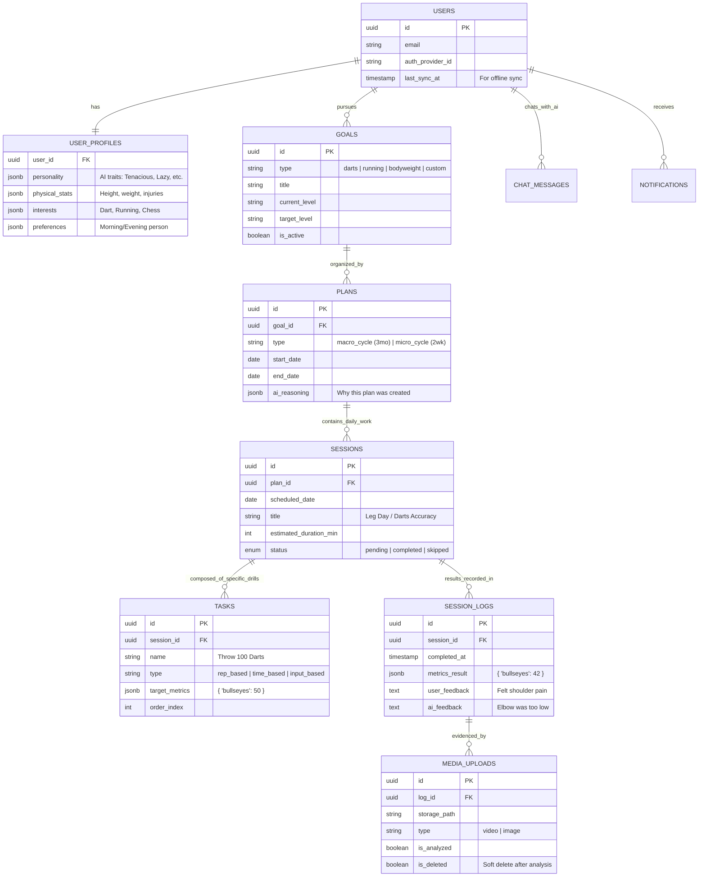

# My Best - The Master Architecture & Development Plan

## 1. Executive Summary
**My Best** is an AI-first personal development ecosystem designed to guide users to their peak potential through hyper-personalized coaching.

**Core Philosophy:** "Observe, Analyze, Adapt."
The system does not just schedule tasks; it consumes user performance data (video, stats, feedback) to dynamically rewrite the future training plan, acting as a real human coach would.

**Key Technical Pillars:**
1.  **Offline-First Mobile Architecture**: Users can train in a dungeon; data syncs when they emerge.
2.  **Ephemeral Heavy Media**: Video is analyzed by AI and deleted to minimize cost/privacy risk.
3.  **Proactive Intelligence**: The AI "nudges" (Push Notifications) based on schedule adherence.

---

## 2. Detailed Data Architecture (The Brain)

We use **PostgreSQL** (via Supabase) with **Drizzle ORM**.

### Entity Relationship Diagram (ERD)

---

## 3. System Architecture & Data Flow

### The "Ephemeral Media" Pipeline (Cost Optimization)
1.  **Capture**: User records 10s video of dart throw on Mobile (Offline supported).
2.  **Compress**: App uses `ffmpeg-kit-react-native` to compress 4K -> 720p/1080p (high compression).
3.  **Upload**: Uploads to Supabase Storage bucket `temp-analysis`.
4.  **Trigger**: Database row inserted in `media_uploads`.
5.  **Analyze (Edge Function)**:
    -   Fetch video.
    -   Send to Xiaomi MiMo (Multimodal) with prompt: *"Analyze throwing mechanics. Return JSON violations + correction tips."*
    -   **CRITICAL**: Save JSON result to `session_logs.ai_feedback`.
6.  **Cleanup**: Delete video from Storage. Mark `media_uploads.is_deleted = true`.

### Offline Synchronization Strategy (WatermelonDB / RxDB pattern)
-   **Local DB**: SQLite on Expo mobile app.
-   **Sync Logic**:
    -   When `online`: Push local `dirty` rows to Supabase.
    -   Pull `last_sync_at > local_last_sync` from Supabase.
-   **Conflict Resolution**: Last-write-wins (Server authority for plan changes, Client authority for logs).

---

## 4. Development Phases (Zero to Hero)

We will execute this in **6 Sprints**.

### Phase 1: Foundation & Identity (Current)
*Goal: A working skeleton where users can sign up and see a dashboard.*
1.  **Monorepo Setup**: Bun + Turbo + Shared Packages (`ui`, `db`, `ai`). [DONE]
2.  **Database**: Deploy schema to Supabase. [PENDING]
3.  **Web Auth**: Login/Register with Supabase Auth UI (HeroUI).
4.  **Mobile Auth**: React Native Login screen + Token storage (SecureStore).

### Phase 2: The AI "Interviewer" (Onboarding)
*Goal: The AI learns who the user is.*
1.  **AI Package**: Build `packages/ai` with context memory management.
2.  **Chat UI (Web/Mobile)**: A beautiful chat interface (like ChatGPT).
3.  **Onboarding Logic**:
    -   System Prompt: *"You are an empathetic but rigorous coach..."*
    -   Extraction Logic: Convert chat text -> `user_profiles` JSON updates.
    -   UI: "Type your hobby" -> AI suggests "Darts".

### Phase 3: The Planner & Calendar Engine
*Goal: Generating the first schedule.*
1.  **Plan Generation**:
    -   Prompt: *"Create 2-week micro-cycle for Beginner Darts player available M/W/F."*
    -   Parser: Convert LLM JSON -> Insert into `plans`, `sessions`, `tasks`.
2.  **Calendar View**:
    -   Web: Big reactive calendar (HeroUI).
    -   Mobile: Agenda list view (FlashList).
3.  **Task Detail View**: "Today's Workout" screen.

### Phase 4: The Collector (Mobile Focused)
*Goal: Logging data offline/online.*
1.  **Media Capture**: Camera integration (Expo Camera).
2.  **Video Compression**: Integration of compression library.
3.  **Offline SQLite**: Set up local caching for sessions/logs.
4.  **Upload Queue**: Background job to upload videos when Wi-Fi connects.

### Phase 5: The Feedback Loop (Analysis)
*Goal: Closing the loop.*
1.  **Analysis Agent**: Build the function that takes Video + Log -> Generates Feedback.
2.  **Adjustment Engine**: If user fails tasks -> Auto-modify future sessions in DB.
3.  **Notifications**: "Nudge" logic (Cron job checking `sessions` table for missed workouts).

### Phase 6: Polish & Launch
*Goal: "Flawless and Flowy"*
1.  **Visuals**: Add charts (Recharts/Victory) for progress.
2.  **Animations**: Shared Element Transitions on mobile.
3.  **Optimistic UI**: Interface updates instantly before server confirms.

---

## 5. UI/UX Guidelines

-   **Color Palette**: Dark mode default. Deep Midnight Blue backgrounds (`#0a0a0a`), Neon Accents (Blue/Purple gradients) for active states.
-   **Typography**: `Geist Sans` for UI, `Geist Mono` for data.
-   **Interaction**:
    -   **Mobile**: Swipe to complete tasks. Haptic feedback on every "Save".
    -   **Web**: Keyboard shortcuts for quick logging.
-   **Loading**: Skeleton screens everywhere. No spinners unless absolutely necessary.

---

## 6. Immediate Next Steps (Todo List)

1.  **Auth Implementation**:
    -   Create Supabase Client Helper.
    -   Build `apps/web/app/login/page.tsx`.
    -   Build `apps/mobile/app/login.tsx`.
2.  **Database Push**:
    -   Run `drizzle-kit push` to apply schema to Supabase.

Shall we execute **Step 1: Database Push** and then **Step 2: Auth Implementation**?
